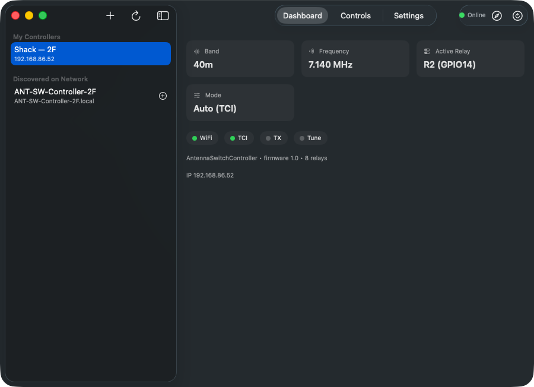
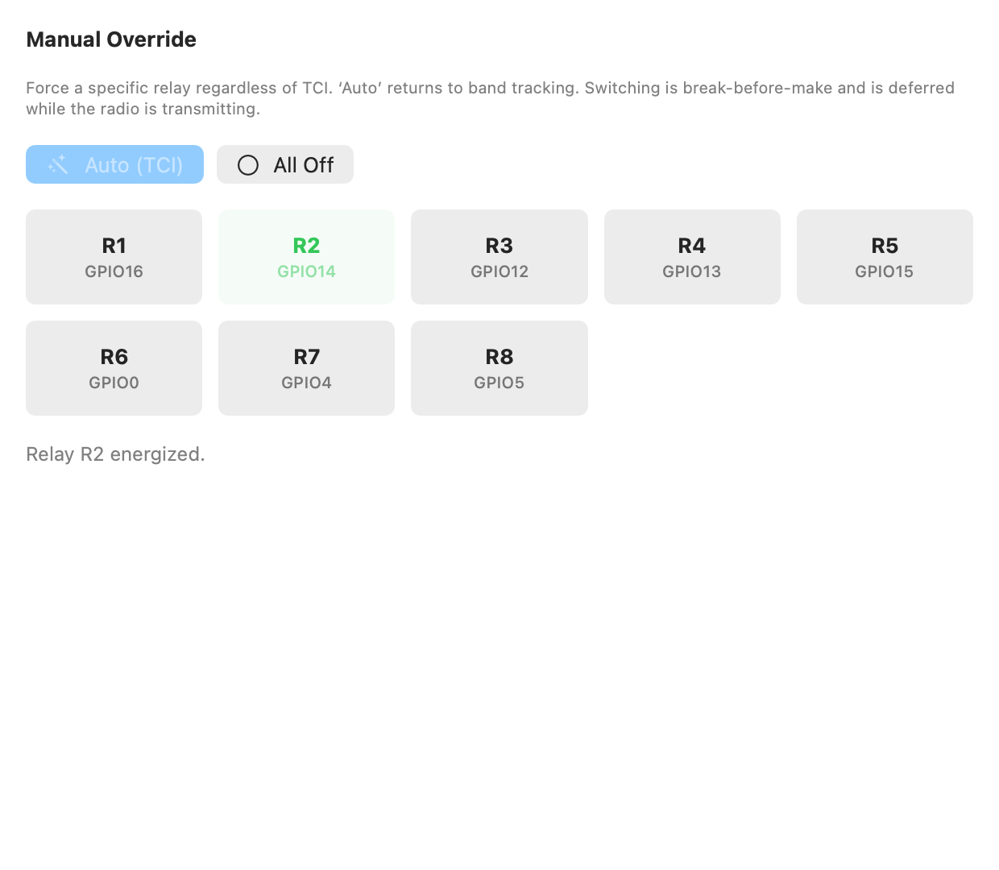
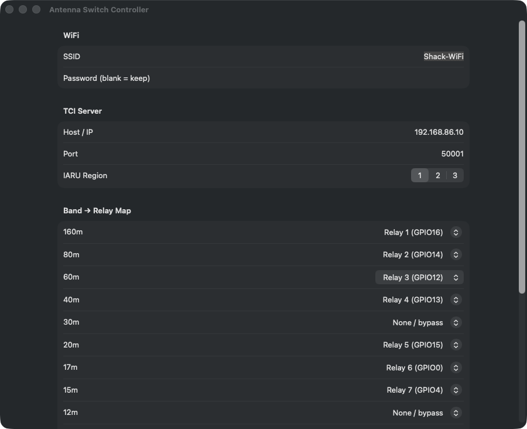
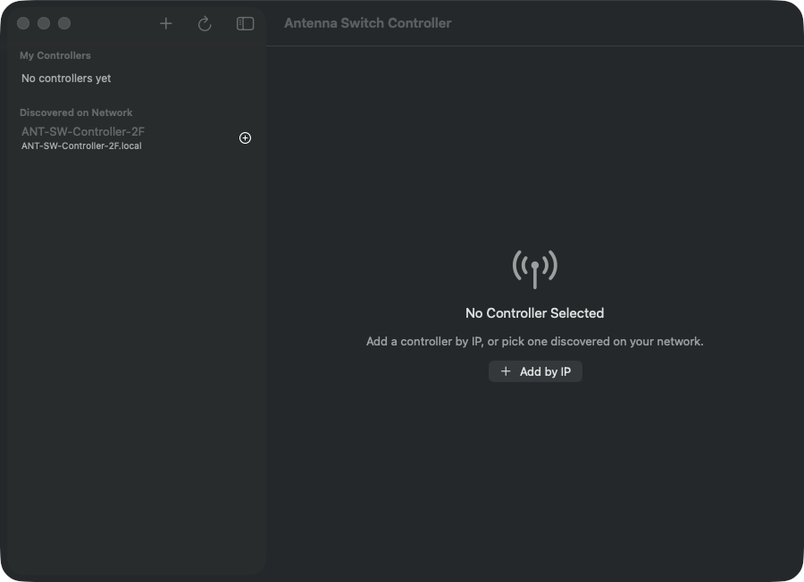
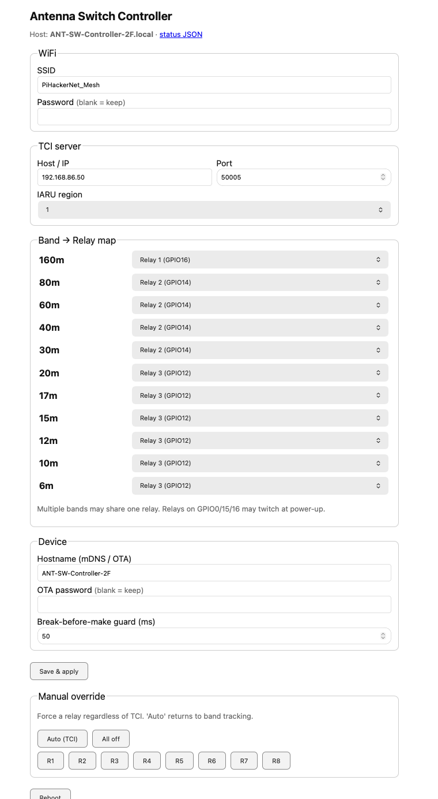

# Antenna Switch Controller — macOS App

A macOS app to manage **multiple** [Antenna Switch Controllers](../ESP8266_ANT_SW)
on your network. Add controllers by IP/hostname or pick them up automatically via
Bonjour, then monitor and fully configure each one — every option from the
controller's web page is available in the app.

Built as a [RadioPluginKit](https://github.com/VU3ESV/RadioPluginKit) plugin, so
it runs **standalone** *and* as a tab inside the
[Amateur Radio Suite](https://github.com/VU3ESV/AmateurRadioApps) container.

<p align="center">
  
</p>

## The hardware it controls

Each controller is an [ESP8266 ESP-12F 8-channel relay board](https://werner.rothschopf.net/microcontroller/202108_esp8266_esp12f_relay_x8_en.htm)
running the [ESP8266_ANT_SW](../ESP8266_ANT_SW) firmware. The firmware listens to
the radio's **TCI** server (IW7DMH library), reads the active band, and switches
the mapped antenna relay with exclusive **break-before-make** switching. The
board's 8 relays are driven directly from GPIO (active-HIGH).

<p align="center">
  
</p>

## Screenshots

**Dashboard** — live band, frequency, active relay, mode, and WiFi/TCI/TX/Tune
status (here: controller `2F` connected, on 40 m / 7.140 MHz, relay R2, Auto/TCI):



**Controls** — manual override: force any relay, All Off, or return to Auto (TCI).
The energized relay is highlighted; switching is break-before-make and deferred
during transmit:



**Settings** — every option from the web page: WiFi, TCI host/port + IARU region,
the full band→relay map, hostname, OTA password, and break-before-make guard:



**Add by IP & auto-discovery** — the sidebar lists saved controllers and any found
on the network via Bonjour; add one by IP or pick a discovered unit:



### The controller's built-in web page

Every option in the app mirrors the controller's own web portal (served by the
firmware), shown here for reference — the app talks to the same `/config`,
`/save`, `/status` and `/relay` routes behind the scenes:

<p align="center">
  
</p>

## Features

- **Multiple controllers** — a sidebar lists every controller you've added; each
  has its own live dashboard, controls, and settings.
- **Add by IP / hostname** — e.g. `192.168.1.42` or `ANT-SW-Controller-7A.local`.
- **Auto-discovery** — browses Bonjour `_antsw._tcp`; discovered controllers
  appear under "Discovered on Network", one tap to add.
- **Dashboard** — live band, frequency, active relay, mode (auto/forced), and
  WiFi / TCI / TX / Tune / Switching status (polls `/status` every 2 s).
- **Controls** — manual override: force any relay (R1–R8), All Off, or Auto (TCI).
- **Settings** — full config form mirroring the web page: WiFi, TCI host/port +
  IARU region, **band→relay map** (160 m–6 m), hostname, OTA password,
  break-before-make guard delay. Reads `/config`, writes `/save`.
- **Per-controller actions** — open the web portal, reboot.

## Build & run (standalone)

```bash
swift build                              # debug
./build-app.sh                           # release → dist/Antenna Switch Controller.app
open "dist/Antenna Switch Controller.app"
```

> If your global git sets `safe.bareRepository=explicit`, prefix builds with:
> `GIT_CONFIG_COUNT=1 GIT_CONFIG_KEY_0=safe.bareRepository GIT_CONFIG_VALUE_0=all`
> so SwiftPM can read the fetched RadioPluginKit checkout.

## Host inside the Amateur Radio Suite

This package exposes the plugin product `AntennaSwitchControllerKit` and the
adapter `AntennaSwitchPlugin: RadioPlugin`. To add it to the container
(`AmateurRadioApps`), make the same two edits used for the other plugins:

**1. `Package.swift`** — add the dependency and product:

```swift
dependencies: [
    .package(url: "https://github.com/VU3ESV/RadioPluginKit.git", from: "1.0.0"),
    // …existing plugin apps…
    .package(path: "../AntennaSwitchControllerApp"),
],
targets: [
    .executableTarget(
        name: "RadioSuite",
        dependencies: [
            .product(name: "RadioPluginKit", package: "RadioPluginKit"),
            // …existing…
            .product(name: "AntennaSwitchControllerKit", package: "AntennaSwitchControllerApp"),
        ],
        path: "Sources/RadioSuite"
    ),
]
```

**2. `Sources/RadioSuite/PluginRegistry.swift`** — import and register:

```swift
import AntennaSwitchControllerKit
// …
static func all(host: PluginHost) -> [any RadioPlugin] {
    [
        LP700Plugin(host: host),
        LP100APlugin(host: host),
        BPFPlugin(host: host),
        AntennaSwitchPlugin(host: host),   // ← added
    ]
}
```

That's it — the suite renders it as an "Antenna Switch" tab. The plugin uses the
host-provided isolated `UserDefaults` (`host.defaults(for: "antsw")`) for its
saved controller list, so it never collides with other plugins.

## Controller HTTP API used

| Route | Method | Used for |
|-------|--------|----------|
| `/discover` | GET | identity (device, firmware version, relays) |
| `/status`   | GET | live state (band, active relay, TCI/WiFi/TX…) |
| `/config`   | GET | stored settings → Settings form (no passwords) |
| `/save`     | POST (form) | persist settings |
| `/relay?set=auto\|none\|0..7` | POST | manual override |
| `/reboot`   | POST | soft reboot |

Discovery is via the firmware's `_antsw._tcp` Bonjour service (TXT: version,
product, host).
