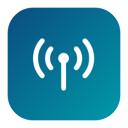
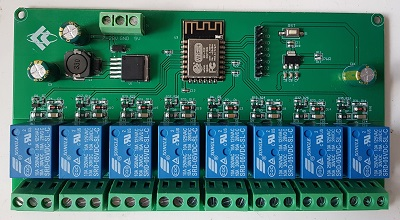
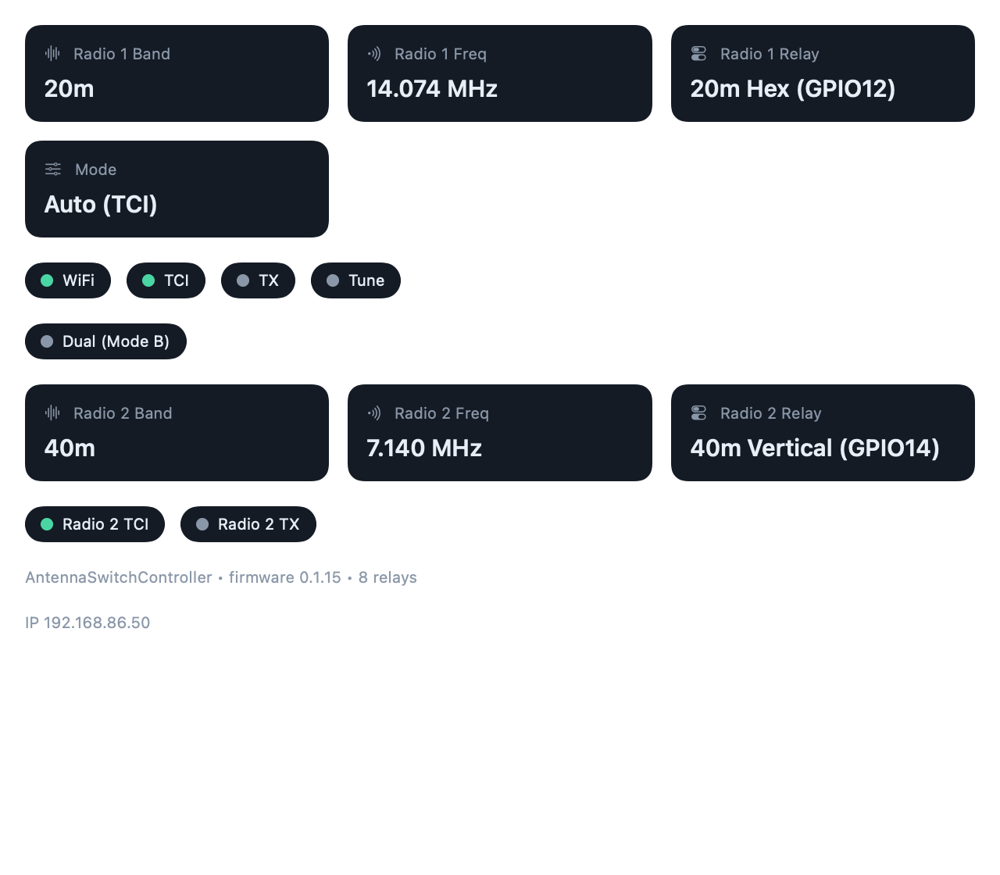
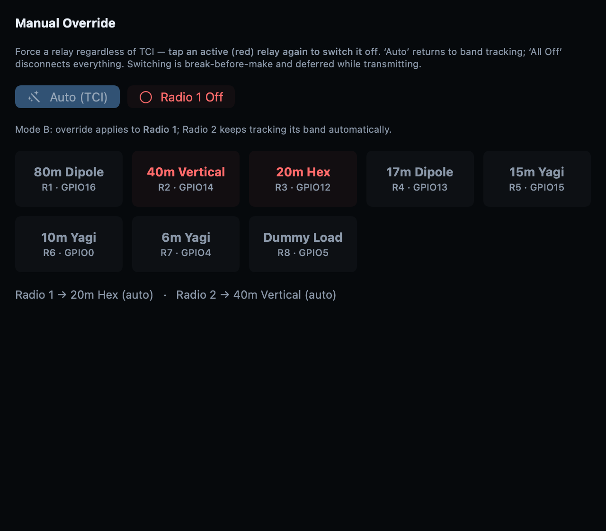
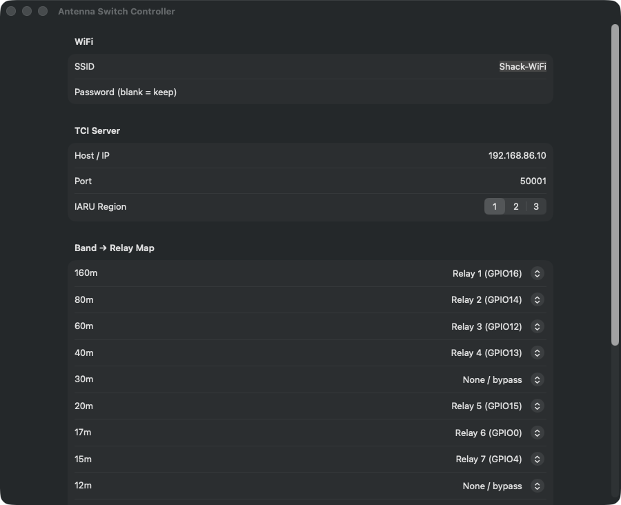
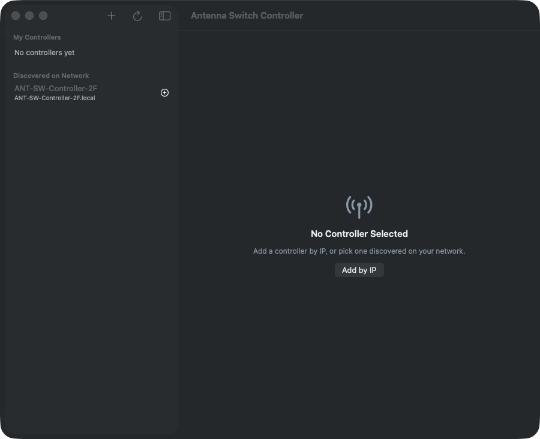
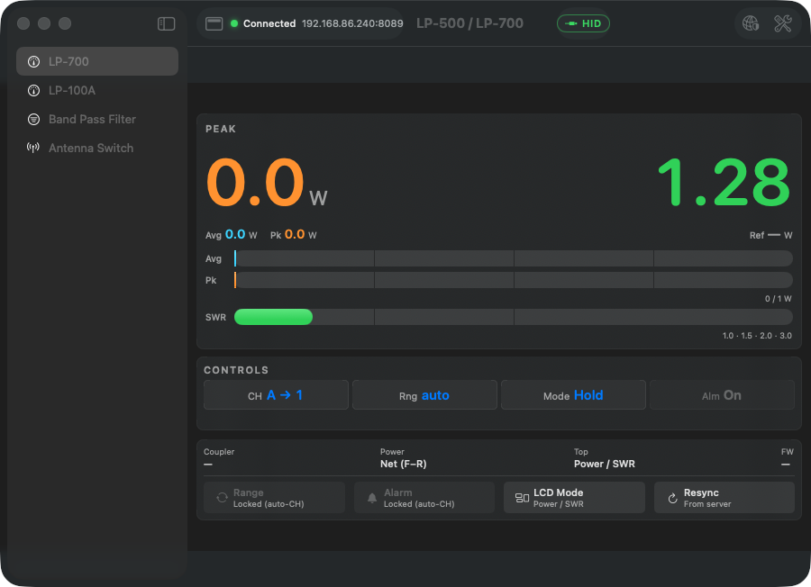

# Antenna Switch Controller

[](https://github.com/VU3ESV/AntennaSwitchController/actions/workflows/ci.yml)
[](https://github.com/VU3ESV/AntennaSwitchController/actions/workflows/release.yml)

A band-following **antenna switch** for amateur radio: an ESP8266 controller that
tracks the radio's active band (over **TCI** or **FlexRadio SmartSDR**) and
switches the matching antenna relay automatically — with full **SO2R** support
(two radios) — plus a **macOS app** to manage multiple controllers from one
window.

See the [CHANGELOG](CHANGELOG.md) for what's new in each release.

<p align="center">
  
</p>

This repo has two parts:

| Folder | What |
|--------|------|
| [`Controller/`](Controller/) | ESP8266 firmware (Arduino sketch) for the [ESP-12F 8-channel relay board](https://werner.rothschopf.net/microcontroller/202108_esp8266_esp12f_relay_x8_en.htm) |
| [`App/`](App/) | macOS SwiftUI app + [RadioPluginKit](https://github.com/VU3ESV/RadioPluginKit) plugin (hostable in [AmateurRadioApps](https://github.com/VU3ESV/AmateurRadioApps)) |

See [CLAUDE.md](CLAUDE.md) for the full requirements/architecture spec.

---

## The Controller (firmware)

Runs on the ESP8266 ESP-12F 8-channel relay board. It tracks the radio's active
band, then energizes the mapped antenna relay with exclusive **break-before-make**
switching — never two antennas at once, and never switching while transmitting.
A web portal maps each band to a relay; firmware updates go **over-the-air**.

<p align="center">
  
</p>

**Highlights**
- **Multi-transport band source** — **TCI** (ExpertSDR3 / SunSDR2 PRO / any
  TCI-compliant, via the bundled IW7DMH library ported to ESP8266) or
  **FlexRadio SmartSDR** (network CAT over TCP 4992). Selectable per unit.
- **SO2R (two radios)** in two topologies — *Mode A* master/slave (two boards,
  LAN interlock) and *Mode B* single board driving an external **8×2** switch.
  See [Multi-radio & SO2R](#multi-radio--so2r) below.
- **Multi-receiver radios** — a SunSDR2 with two receivers (RX1/RX2) drives SO2R
  from **one** board over a single shared TCI link (RX1 + RX2).
- **Named antennas** — give each relay a name (e.g. "80m Dipole"); it shows
  across the app and web UI instead of "R1–R8".
- 11 bands (160 m–6 m incl. 60 m); each band → one of 8 relays or none/bypass.
- Exclusive, break-before-make switching (~50 ms guard); deferred during TX/tune.
- Failsafe: all relays de-energized on boot / WiFi loss / radio loss / unmapped band.
- Web config portal, EEPROM + CRC32 persistence (with versioned migration), mDNS,
  SoftAP first-run setup.
- ArduinoOTA updates; `_antsw._tcp` Bonjour service + `/config` JSON for the app.

### Build & flash

```bash
arduino-cli core install esp8266:esp8266
arduino-cli lib install WebSockets          # TCI lib is bundled in Controller/

# Initial USB flash (board in flash mode: GPIO0->GND + reset)
arduino-cli compile --fqbn esp8266:esp8266:generic:eesz=4M1M \
  --upload --port /dev/cu.usbserial-XXXX Controller

# OTA update (board already on the LAN)
arduino-cli compile --fqbn esp8266:esp8266:generic:eesz=4M1M \
  --output-dir /tmp/antsw_build Controller
python3 ~/Library/Arduino15/packages/esp8266/hardware/esp8266/*/tools/espota.py \
  -i <board-ip> -p 8266 -f /tmp/antsw_build/Controller.ino.bin -r
```

On first boot (no WiFi saved) the controller starts a setup AP **`ANT-SW-Setup`**
→ open `http://192.168.4.1/` to enter WiFi + TCI settings. After that it joins
your LAN as `ANT-SW-Controller-xx.local`.

> Many bare USB-TTL adapters lack DTR/RTS auto-reset, so flash mode is manual
> (hold GPIO0→GND, tap reset) and you must release GPIO0 + reset to run the sketch.

---

## Multi-radio & SO2R

Each unit runs in one of four **modes** (set in the web portal or the app). The
full design is in [docs/MULTI-RADIO-SO2R-PLAN.md](docs/MULTI-RADIO-SO2R-PLAN.md).

| Mode | Radios | Switch | What it does |
|------|--------|--------|--------------|
| **Standalone** | 1 | 8×1 | Today's single-radio band → relay (default). |
| **Master** | 1 (Radio 1) | 8×1 | Mode A arbiter; coordinates a slave over the LAN. |
| **Slave** | 1 (Radio 2) | 8×1 | Mode A; claims antennas from its master. |
| **Dual** | 2 | 8×2 | Mode B; one board tracks both radios, drives an 8×2 switch. |

**Interlock (both SO2R modes):** an antenna in use by one radio is never given to
the other. Policy is **first-come / current-holder-keeps-it** (the radio already
on a contended antenna keeps it; the other falls back) — a transmitting radio's
antenna is also held fixed (no hot-switching).

### Mode A — Master / Slave (two boards, best isolation)
Two standard 8×1 boards, one radio each, plus per-band 1×2 switches for RF
isolation. They coordinate over the LAN with a **debounced heartbeat** (claim
every 2 s; loss declared only after 3 missed beats / 6 s, so one dropped packet
never drops an antenna). On master loss the slave fails safe (or holds).

```
  Radio 1 ── MASTER 8×1 ──┐
                          ├──► per-antenna 1×2 ──► antenna i   (only one radio at a time)
  Radio 2 ── SLAVE  8×1 ──┘   coordinated over the LAN (interlock + heartbeat)
```

### Mode B — single board + external 8×2 switch
**One** board tracks **both** radios and drives an external **8×2** switch. The 8
relays wire straight to the switch: **relay _i_ = antenna _i_**, and the relay for
**each** radio's antenna is energized — so up to **two** relays are HIGH at once
(one per radio), the switch routing each to its radio. The in-firmware interlock
keeps the two distinct.

```
  Radio 1 ─┐
           ├─► ONE board (2 sources, interlock in firmware) ─► external 8×2 switch ─► 8 antennas
  Radio 2 ─┘
```

### One SunSDR2 with two receivers → SO2R from one board
A radio that exposes **two receivers** over TCI (e.g. SunSDR2 PRO) is driven as
Mode B from a single board: point **both** radios at the **same** TCI host/port,
set **Radio 1 = RX1** and **Radio 2 = RX2**, and pick the **8×2** switch.

| Setting | Radio 1 | Radio 2 |
|---|---|---|
| Type / Host / Port | TCI · `<SunSDR IP>` · `50001` | TCI · **same IP** · **same port** |
| Receiver | **RX1** | **RX2** |
| External switch | — | **8×2** |

Each receiver follows its own band → antenna; the interlock guarantees they never
land on the same antenna.

> **Two _separate_ radios** (different IP/port)? Give each its own Host/Port and
> leave both on **RX1** — RX2 is only for a single radio that exposes a second
> receiver. The app hides the RX picker unless both radios share one Host/Port.

---

## The App (macOS)

Manage **multiple** controllers on your network — add by IP/hostname or pick them
up automatically via Bonjour, then monitor and fully configure each one. Every
option from the controller's web page is available natively.

**Dashboard** — live band, frequency, and the **named** active antenna per radio,
plus mode and WiFi/TCI/TX/Tune. In **Mode B** it shows *both* radios (here: Radio 1
on 20 m → "20m Hex", Radio 2 on 40 m → "40m Vertical", firmware 0.1.15):



**Controls** — manual override: tap a relay to force it (energized relays show in
**red**), tap an active relay again to switch it off, or use Auto (TCI) / All Off.
Relays are labeled with your antenna names; the summary shows each radio's antenna:



**Settings** — every web-page option: WiFi, radio type (TCI / FlexRadio) + host/port
+ receiver (RX1/RX2) + IARU region, **per-relay antenna names**, the full band→relay
map, the **SO2R role** (Standalone / Master / Slave / Dual) with interlock policy
and — for Dual — the second radio + 8×2 switch, plus hostname, OTA password,
break-before-make guard:



**Add by IP & auto-discovery** — the sidebar lists saved controllers and any found
on the network; add one by IP or pick a discovered unit:



### The controller's built-in web page

The app mirrors the controller's own web portal (same `/config`, `/save`,
`/status`, `/relay` routes), shown here for reference:

<p align="center">
  
</p>

### Build & run (standalone)

```bash
cd App
swift build                              # debug
./build-app.sh                           # release → dist/Antenna Switch Controller.app
open "dist/Antenna Switch Controller.app"
```

> If your global git sets `safe.bareRepository=explicit`, prefix builds with
> `GIT_CONFIG_COUNT=1 GIT_CONFIG_KEY_0=safe.bareRepository GIT_CONFIG_VALUE_0=all`
> so SwiftPM can read the fetched RadioPluginKit checkout.

### Install a release build (unsigned app)

Prebuilt **universal** (Apple Silicon + Intel) `.app` bundles are attached to each
[GitHub Release](https://github.com/VU3ESV/AntennaSwitchController/releases).

The app is **not code-signed or notarized** (no Apple Developer ID), so when you
copy it to another Mac, Gatekeeper quarantines it and refuses to open it
("…is damaged" / "cannot be opened"). Clear the quarantine flag once:

```bash
# 1. Open the .dmg and drag the app to /Applications, then:
xattr -dr com.apple.quarantine "/Applications/Antenna Switch Controller.app"
# 2. Open it (first launch can also be done via right-click → Open):
open "/Applications/Antenna Switch Controller.app"
```

`xattr -dr com.apple.quarantine …` recursively removes the
`com.apple.quarantine` extended attribute macOS adds to downloaded files; without
it Gatekeeper blocks an unsigned, un-notarized bundle. On first launch, allow
**Local Network** access so discovery and controller communication work.

### Releases & CI

- **CI** ([`.github/workflows/ci.yml`](.github/workflows/ci.yml)) builds the macOS
  app (debug + release `.app`) on every push/PR, and compiles the ESP8266 firmware
  with `arduino-cli`.
- **Release** ([`.github/workflows/release.yml`](.github/workflows/release.yml))
  builds the **universal `.app`** (packaged as a **`.dmg`**), the suite
  **`.radioplugin`**, *and* the **ESP8266 firmware (`.bin`)**, then publishes a
  GitHub Release with all three + install/flash instructions. It triggers three
  ways:
  - **PR merged into `main`** → auto-bumps the latest `vX.Y.Z` tag (patch) and releases;
  - pushing a **`vX.Y.Z` tag** → releases that tag;
  - **manual dispatch** with a tag.

  Each release attaches `Antenna-Switch-Controller-macOS.dmg` (the app),
  `AntennaSwitch.radioplugin` (the suite plugin), and
  `AntennaSwitchController-firmware.bin` (flash via OTA `espota.py` or USB).

### Host inside the Amateur Radio Suite

Verified building and running as a tab ("Antenna Switch") in the
`AmateurRadioApps` container, alongside LP-700, LP-100A, and Band Pass Filter:



The package exposes the plugin product `AntennaSwitchControllerKit` and the
adapter `AntennaSwitchPlugin: RadioPlugin`. With this repo checked out next to
`AmateurRadioApps`, make the same two edits used for the other plugins:

**1. `AmateurRadioApps/Package.swift`** — add the dependency and product:

```swift
dependencies: [
    .package(url: "https://github.com/VU3ESV/RadioPluginKit.git", from: "1.0.0"),
    // …existing plugin apps…
    .package(path: "../AntennaSwitchController/App"),
],
targets: [
    .executableTarget(
        name: "RadioSuite",
        dependencies: [
            .product(name: "RadioPluginKit", package: "RadioPluginKit"),
            // …existing…
            .product(name: "AntennaSwitchControllerKit", package: "App"),
        ],
        path: "Sources/RadioSuite"
    ),
]
```

**2. `AmateurRadioApps/Sources/RadioSuite/PluginRegistry.swift`** — import and register:

```swift
import AntennaSwitchController            // the module (target), not the product
// …
static func all(host: PluginHost) -> [any RadioPlugin] {
    [
        LP700Plugin(host: host),
        LP100APlugin(host: host),
        BPFPlugin(host: host),
        AntennaSwitchPlugin(host: host),   // ← added
    ]
}
```

The plugin uses the host-provided isolated `UserDefaults`
(`host.defaults(for: "antsw")`) for its saved controller list, so it never
collides with other plugins.

### Controller HTTP API used by the app

| Route | Method | Used for |
|-------|--------|----------|
| `/discover` | GET | identity (device, firmware version, relays) |
| `/status`   | GET | live state (band, per-radio relays `radio1_relay`/`radio2_relay`, `relay_mask`, TCI/WiFi/TX, interlock, radio 2…) |
| `/config`   | GET | stored settings → Settings form (radio type/receiver, mode/peer/interlock, radio 2, switch type, **relay names**… no passwords) |
| `/save`     | POST (form) | persist settings |
| `/relay?set=auto\|none\|0..7` | POST | manual override |
| `/interlock` | GET | SO2R Mode A interlock state (`role, peer_up, beats_missed, master_ant, slave_ant`) |
| `/interlock/claim?ant=i` · `/interlock/release` | POST | SO2R: slave claim/release (master side); also the heartbeat |
| `/reboot`   | POST | soft reboot |

Discovery is via the firmware's `_antsw._tcp` Bonjour service (TXT: version,
product, host).
